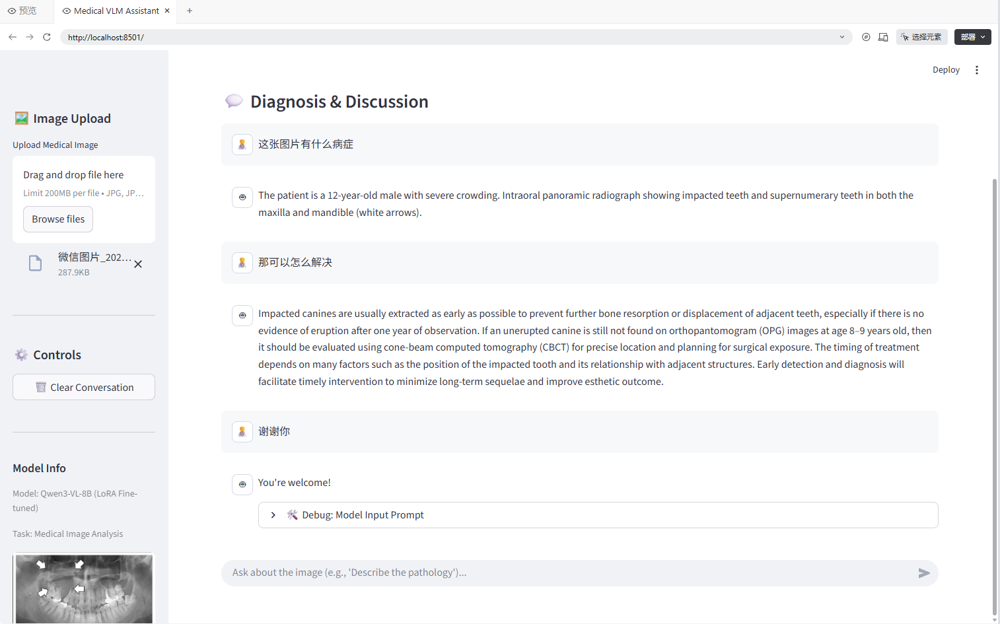

# Medical VLM Fine-tuning & Inference Assistant

这是一个基于 [Unsloth](https://github.com/unslothai/unsloth) 和 [Qwen3-VL](https://github.com/QwenLM/Qwen3-VL) 的医疗视觉大模型微调与部署项目。本项目演示了如何使用 LoRA 高效微调多模态大模型，使其具备专业的医疗影像诊断能力，并提供了一个基于 Streamlit 的可视化对话界面。

## 🚀 项目功能

*   **高效微调**：使用 Unsloth 加速 Qwen3-VL-8B 的 LoRA 微调，大幅降低显存需求并提升训练速度。
*   **医疗场景适配**：针对医疗影像（如 X 光、CT 等）进行指令微调，使模型能够像放射科医生一样描述病灶。
*   **可视化交互**：提供 Streamlit Web 应用，支持上传图片进行多轮医学对话。
*   **多轮对话支持**：微调后的模型支持结合上下文的多轮问答。

## 📂 项目结构

```
.
├── train.py            # 微调脚本 (Python 版本)
├── app.py              # Streamlit 可视化部署应用
├── requirements.txt    # 项目依赖文件
├── README.md           # 项目说明文档
├── data/               # 训练数据集目录
└── lora_model/         # (自动生成) 微调后的 LoRA 权重
```

## 🛠️ 准备工作

### 1. 环境安装
建议使用 Conda 创建虚拟环境：
```bash
conda create -n vlm python=3.10
conda activate vlm
pip install -r requirements.txt
```
*注意：Unsloth 的安装可能需要特定的 CUDA 版本，请参考 [Unsloth 官方文档](https://github.com/unslothai/unsloth) 进行适配。*

### 2. 下载基础模型
本项目使用 [Qwen3-VL-8B-Instruct-bnb-4bit](https://www.modelscope.cn/models/unsloth/Qwen3-VL-8B-Instruct-bnb-4bit) 作为基座模型。你可以使用 modelscope CLI 进行下载：

```bash
# 安装 modelscope
pip install modelscope

# 下载模型到本地 models 目录
modelscope download --model unsloth/Qwen3-VL-8B-Instruct-bnb-4bit --local_dir models/unsloth/Qwen3-VL-8B-Instruct-bnb-4bit
```

### 3. 准备数据集
本项目使用 [Radiology-mini](https://huggingface.co/datasets/open-data/Radiology-mini) 数据集进行演示。请前往 Hugging Face 下载并将数据解压到 `data/` 目录中。

## 🏃‍♂️ 快速开始

### 1. 模型微调

#### 使用 Python 脚本
直接运行以下命令进行训练：
```bash
python train.py
```
训练过程会自动加载模型、处理数据、微调并保存权重到 `lora_model/` 目录。

### 2. 启动 Web 应用
训练完成后，使用 Streamlit 启动可视化界面：
```bash
streamlit run app.py
```
访问终端显示的 URL（通常是 http://localhost:8501 或 http://localhost:6006）即可使用。

## 🧪 效果展示




